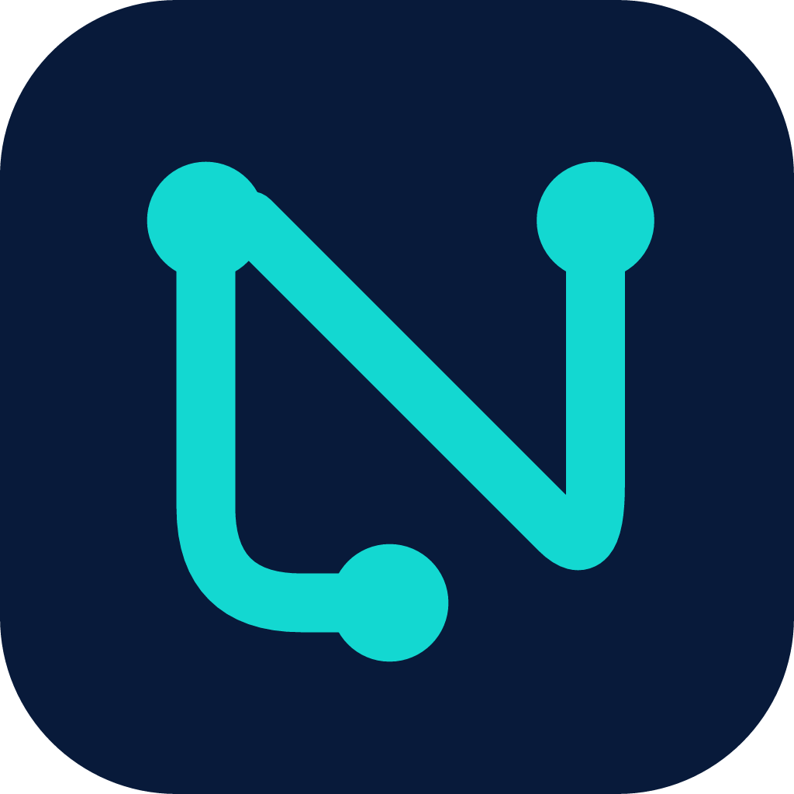

  

<h1 align="center">niraNG</h1>

  کلاینت اندروید Xray با رابط Liquid Glass، اتصال VPN و پراکسی محلی
   
  An Android Xray client with Liquid Glass UI, VPN and local proxy support

  <a href="https://github.com/bardia-us/niraNG/releases/latest">دانلود اندروید · Android</a>
  &nbsp;|&nbsp;
  <a href="https://github.com/bardia-us/niraN/releases/latest">دانلود ویندوز · Windows</a>
  &nbsp;|&nbsp;
  <a href="#english">English</a>

## دانلود اندروید

**اگر معماری گوشی را نمی‌دانید، نسخهٔ Universal را بگیرید.** این فایل بزرگ‌تر است و هر سه معماری پشتیبانی‌شده را در خود دارد.

| نسخه | مناسب برای | دانلود |
| --- | --- | --- |
| **Universal** | ARM64، ARM32 و x86-64 در یک فایل | [APK](https://github.com/bardia-us/niraNG/releases/download/v1.2.1/niraNG-v1.2.1-universal.apk) |
| **arm64-v8a** | بیشتر گوشی‌های جدید با اندروید ۶۴بیتی ARM | [APK](https://github.com/bardia-us/niraNG/releases/download/v1.2.1/niraNG-v1.2.1-arm64-v8a.apk) |
| **armeabi-v7a** | دستگاه‌های ARM با اندروید ۳۲بیتی | [APK](https://github.com/bardia-us/niraNG/releases/download/v1.2.1/niraNG-v1.2.1-armeabi-v7a.apk) |
| **x86_64** | دستگاه‌ها و شبیه‌سازهای x86-64؛ نه بیشتر گوشی‌ها | [APK](https://github.com/bardia-us/niraNG/releases/download/v1.2.1/niraNG-v1.2.1-x86_64.apk) |

نیازمند **Android 7.0 یا جدیدتر** و یکی از معماری‌های بالا است. Universal به معنی پشتیبانی از تمام نسخه‌ها و دستگاه‌های اندروید نیست.

لینک‌های جدول مربوط به **v1.2.1** هستند؛ برای انتشارهای بعدی همیشه [صفحهٔ آخرین نسخه](https://github.com/bardia-us/niraNG/releases/latest) را بررسی کنید.

## نسخهٔ ویندوز: niraN

**niraN** نسخهٔ ویندوز این خانواده است؛ برنامهٔ اندروید با نام **niraNG** منتشر می‌شود. فایل‌ها و نسخه‌های این دو برنامه جدا هستند.

| پلتفرم | برنامه | دریافت |
| --- | --- | --- |
| Android | niraNG | [آخرین APKها](https://github.com/bardia-us/niraNG/releases/latest) |
| Windows x64 | niraN | [Setup و نسخهٔ Portable](https://github.com/bardia-us/niraN/releases/latest) |

[صفحهٔ پروژهٔ niraN برای ویندوز](https://github.com/bardia-us/niraN)

## امکانات niraNG

- **اتصال و مدیریت سرورها:** Xray-core، پروتکل‌های VLESS، VMess و Trojan، تست TCP و تأخیر واقعی، مرتب‌سازی و تعویض سرور.
- **VPN و پراکسی محلی:** حالت VPN و Proxy-only، با SOCKS محلی روی پورت پیش‌فرض `10808`.
- **اشتراک:** دریافت و به‌روزرسانی اشتراک مدیریت‌شده، نمایش مصرف و مقدار باقی‌مانده.
- **شبکه و TLS:** تنظیمات DNS و Routing، بای‌پس شبکهٔ محلی و تنظیمات CDN/TLS، از جمله ECH برای TLS.
- **ظاهر و حرکت:** Liquid Glass، انیمیشن‌های نرم، تم روشن/تاریک، رنگ‌های مختلف و بازخورد صدا یا لرزش.
- **Performance Mode:** ظاهر سبک‌تر و مات، بدون شیدر و بلور گلس؛ مناسب دستگاه‌هایی که افکت‌های کامل روی آن‌ها سنگین است.
- **زبان و ابزارها:** فارسی و انگلیسی، پشتیبانی راست‌به‌چپ، انتخاب و کپی متن لاگ، اطلاعات فنی سرورها و قطع اتصال از اعلان.

## شروع و به‌روزرسانی

1. APK مناسب را از همین مخزن دانلود و نصب کنید.
2. برای **به‌روزرسانی، نسخهٔ جدید را روی برنامهٔ فعلی نصب کنید**؛ نیازی به حذف برنامه و از دست دادن تنظیمات نیست.
3. پس از تأیید دسترسی، یک سرور انتخاب کنید و **Connect** را بزنید. در حالت VPN، درخواست مجوز VPN اندروید را تأیید کنید.
4. اگر حرکت صفحه‌ها روی گوشی سنگین است، **Performance Mode** را از تنظیمات روشن کنید.

این برنامه برای اشتراک مدیریت‌شده طراحی شده و واردکردن یا اشتراک‌گذاری کانفیگ خام را ارائه نمی‌کند. لینک تلگرام برنامه از داخل تنظیمات در دسترس است.

## چند نکتهٔ کاربردی

- **APK نصب نمی‌شود؟** معماری فایل و نسخهٔ اندروید را بررسی کنید. نسخهٔ x86_64 جایگزین ARM نیست؛ در صورت تردید Universal را انتخاب کنید. برای به‌روزرسانی هم امضای نصب قبلی باید با فایل جدید سازگار باشد.
- **ظاهر Performance متفاوت است؟** بله؛ مات‌شدن پنل‌ها و حذف گلس در این حالت عمدی است. حالت عادی افکت کامل را نگه می‌دارد.
- **گزارش مشکل:** مدل گوشی، نسخهٔ اندروید، نسخهٔ برنامه و مراحل بازتولید را در [Issues](https://github.com/bardia-us/niraNG/issues) بنویسید. لینک اشتراک، UUID، رمز و کانفیگ خام را در گزارش عمومی نگذارید.

---

## English

**niraNG** is the Android app in the niraN family. It combines Xray connectivity with a Liquid Glass interface, light/dark themes and a lightweight Performance Mode.

### Download

- [Latest Android release](https://github.com/bardia-us/niraNG/releases/latest): choose **Universal** if you are unsure about your device architecture.
- **arm64-v8a** is for 64-bit ARM Android; **armeabi-v7a** is for 32-bit ARM Android.
- **x86_64** is for compatible x86-64 devices and emulators, not a universal phone APK.
- Android **7.0+** and a supported architecture are required.
- Looking for Windows? [niraN for Windows x64](https://github.com/bardia-us/niraN) offers [Setup and Portable downloads](https://github.com/bardia-us/niraN/releases/latest).

### Features and use

VLESS, VMess and Trojan through Xray; VPN and local SOCKS proxy; managed subscriptions and usage information; latency testing and sorting; DNS/routing and CDN/TLS settings; Persian/English UI; sound/haptic feedback; selectable logs.

Install updates **over the existing app** to keep your settings. Select a server, tap **Connect**, and approve Android's VPN permission when using VPN mode. Enable **Performance Mode** for a simpler, matte interface without glass shaders or blur.

The app uses managed subscriptions and does not offer raw configuration import or sharing. Report issues with your device model, Android/app versions and reproduction steps; never include credentials or private subscription links.

---

مجوزها و اطلاعیه‌های اجزای ثالث · [Third-party notices](THIRD_PARTY_NOTICES.md)
